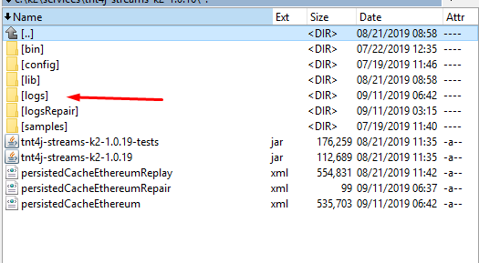

# Logging

The following logging appender configuration

```properties
### StreamsAdmin activities logger ###
log4j.appender.streamsAdmin_error=org.apache.log4j.RollingFileAppender
log4j.appender.streamsAdmin_error.File=${log4j.logs.root.path}/streamsAdmin_error.log
log4j.appender.streamsAdmin_error.maxFileSize=10MB
log4j.appender.streamsAdmin_error.maxBackupIndex=1
log4j.appender.streamsAdmin_error.layout=org.apache.log4j.EnhancedPatternLayout
log4j.appender.streamsAdmin_error.layout.ConversionPattern={"date" : "%d{ISO8601}", %m} %n
log4j.appender.streamsAdmin_error.Threshold=INFO

log4j.logger.streamsAdmin_error=INFO, streamsAdmin_error

log4j.appender.streamsAdminRestLog=org.apache.log4j.RollingFileAppender
log4j.appender.streamsAdminRestLog.File=${log4j.logs.root.path}/streamsAdminRestLog.log
log4j.appender.streamsAdminRestLog.maxFileSize=10MB
log4j.appender.streamsAdminRestLog.maxBackupIndex=1
log4j.appender.streamsAdminRestLog.layout=org.apache.log4j.EnhancedPatternLayout
log4j.appender.streamsAdminRestLog.layout.ConversionPattern={"date" : "%d{ISO8601}", %m} %n
log4j.appender.streamsAdminRestLog.Threshold=INFO
log4j.logger.streamsAdminRestLog=INFO, streamsAdminRestLog
```

Should be placed



