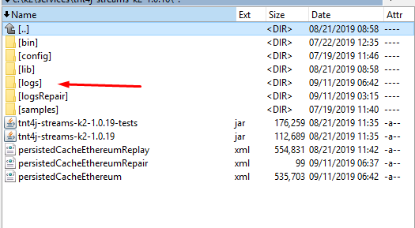
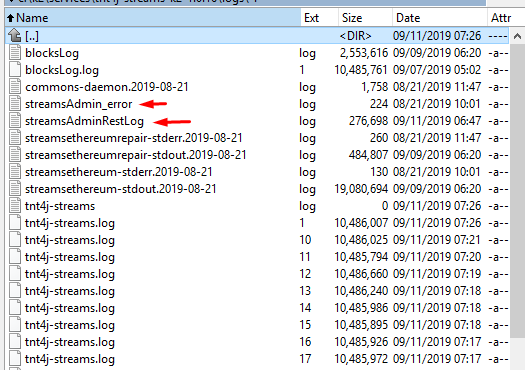
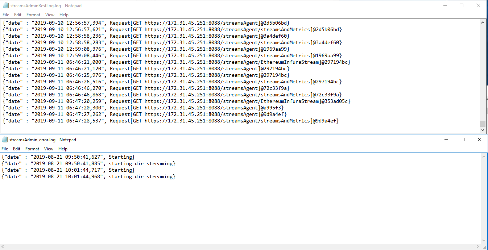

# On correct setup

After the above steps are done stream admin should be ready to launch,

Start your streaming service as usual and streams admin client should fire up

Both logs on startup should contain some useful info.

Rest log will have a log of all requests

Error log should output if dir streaming is on

