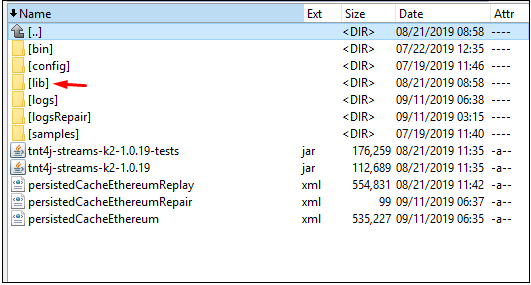

# Streams admin jars placement

The following modules

- tnt4j-streams-admin-registry

- tnt4j-streams-admin-hc

- tnt4j-streams-admin-utils

Should have the following jars

- tnt4j-streams-admin-utils-1.0.jar

- tnt4j-streams-admin-registry-1.0.jar

- tnt4j-streams-admin-hc-1.0.jar

and should be placed in the following folder

  
