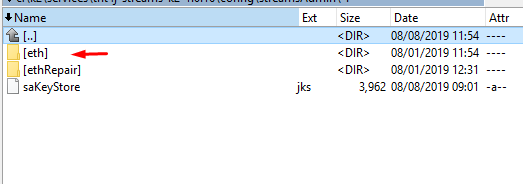

# System properties

Go to registry editor

Set the following jvm properties

- streamsAdmin
  
example

-DstreamsAdmin="C:\k2\services\tnt4j-streams-k2-1.0.16\config\streamsAdmin\eth\streamsAdmin.properties"

system property streamsAdmin should point to the json config

