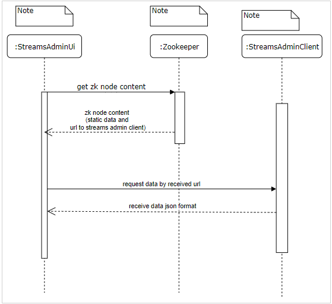
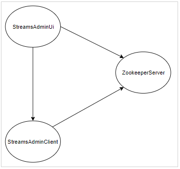

# Network configuration

A simplified view of how StreamsAdminUI communicates with other components

There are 3 components

- streamsAdminUi
- Zookeeper server
- StreamsAdminClient

Zookeeper must have an open port (by default it is 2181) to listen for incoming connections from StreamsAdminUI and StreamsAdminClient

StreamAdminClient must have an open port to listen for incoming requests from from StreamsAdminUI

A top down view of our components

Explanation:

The components from which the line starts from are the components that send requests and the components on which the arrow ends listen to requests

Listeners must have a open port to listen to requests