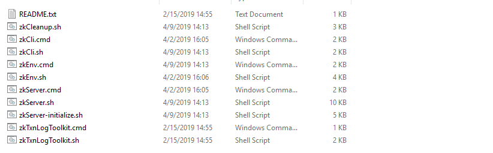
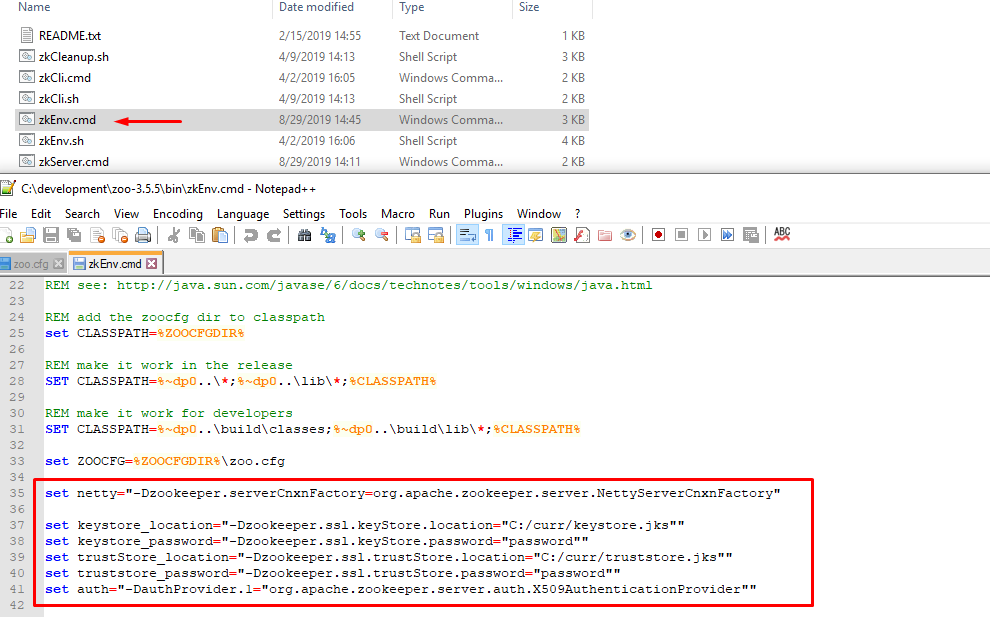

# Zookeeper configuration and deployment


- [Zookeeper configuration and deployment](#zookeeper-configuration-and-deployment)
  - [Configuration](#configuration)
  - [SSL Setup (optional)](#ssl-setup-optional)
  - [Startup](#startup)
    - [Without SSL](#without-ssl)
    - [With SSL](#with-ssl)

## Configuration

Download **Apache Zookeeper 3.5.5** and unzip it, the directory should look like this 


This is how it should not look like


After unzipping go to

**/conf** folder


Create a file named **zoo.cfg** and copy all content of **zoo_sample.cfg** to it  

**/bin** folder

This step is purely optional, we are disabling zookeeper admin server that starts by default on port 8080



in the file **zkServer.cmd** add the following system property 

```java
"-Dzookeeper.admin.enableServer=false"
```

After adding the property the zkServer.cmd should look like this


## SSL Setup (optional)

The final step is to configure zookeeper to use SSL

(https://cwiki.apache.org/confluence/display/ZOOKEEPER/ZooKeeper+SSL+User+Guide

https://zookeeper.apache.org/doc/r3.5.5/zookeeperAdmin.html#Quorum+TLS)

|Notice! |
|--------|
|$(hostname -f) replace with your hostname e.g 127.0.0.1 |

The first step is to generate a a truststore and a keystore

```ps
keytool -genkeypair -alias $(hostname -f) -keyalg RSA -keysize 2048 -dname "cn=$(hostname -f)" -keypass password -keystore keystore.jks -storepass password
```

Extract the certificate from keystore

```ps
keytool -exportcert -alias $(hostname -f) -keystore keystore.jks -file $(hostname -f).cer -rfc
```

Create SSL truststore JKS containing certificates

```ps
keytool -importcert -alias [host1..3] -file [host1..3].cer -keystore truststore.jks -storepass password
```

Client configuration

set the following JVM properties in streams admin client

Set zookeeper client to use Netty

```java
-Dzookeeper.clientCnxnSocket="org.apache.zookeeper.ClientCnxnSocketNetty"
```


In order to do secure communication on client, set this property

```java
-Dzookeeper.client.secure=true
```


Set keystore and truststore locations and passwords 

```java
-Dzookeeper.ssl.keyStore.location
-Dzookeeper.ssl.keyStore.password
-Dzookeeper.ssl.trustStore.location
-Dzookeeper.ssl.trustStore.password
```

e.g

```java
-Dzookeeper.clientCnxnSocket="org.apache.zookeeper.ClientCnxnSocketNetty"
-Dzookeeper.client.secure=true
-Dzookeeper.ssl.keyStore.location=C:/curr/keystore.jks
-Dzookeeper.ssl.keyStore.password=password
-Dzookeeper.ssl.trustStore.location=C:/curr/truststore.jks
-Dzookeeper.ssl.trustStore.password=password
```

Now we setup zookeeper server

Setup secure port in zookeepers zoo.cfg file


Set the same JVM properties in zookeeper server

zkEnv.cmd



and reference the system properties that we set in zkEnv.cmd in zkServer.cmd


## Startup

We should have now finished with the Zookeeper setup

To start Zookeeper we open a Windows CLI (PowerShell/Cmd) and type in the full path to zkServer.cmd 


### Without SSL

If everything was correctly set the output should look like this


### With SSL


With ssl there will be a secure port

When a client connects to ssl secured zookeeper this line will appear

