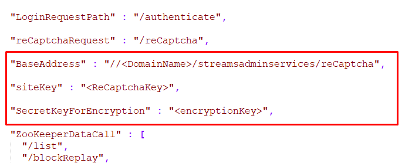

- [Deployment of client and server](#deployment-of-client-and-server)
  - [Deployment server side](#deployment-server-side)
  - [Deployment client side](#deployment-client-side)

# Deployment of client and server
## Preparing the deployment directory
1. Building the ui-web project will create the deployment directory targer. Copy **\tnt4j-streams-admin-ui\tnt4j-streams-admin-ui-web\target\tnt4j-streams-admin-ui-web-1.0** war into the deployment packages clientSide folder.
2. Rename the file from the previous step to "streamsadmin" .
3. For the ui-server side you need to copy the .war file from the build target directory **\tnt4j-streams-admin-ui\tnt4j-streams-admin-ui-server\target\tnt4j-streams-admin-ui-server-1.0** and paste it into the serverSide folder.
4. Rename the file from the previous step to "streamsadminservices" .
5. Copy the configuration files from the server [deploymentDir](/tnt4j-streams-admin-ui/config/ui-server) to serverSide deployment folder.
6. The final deployment directory contains two folders for deployment the
    ***serverSide*** and ***clientSide*** folders.

## Deployment server side: 

### Step 1

-   Go to **serverSide** directory and open the file  named **streamsProperties.properties** set the property named ***ZooKeeperAddress*** to the ZooKeeper ip that we will be connecting to.
-   Set the ***secretKeyCaptcha***  to match the one that you got from Google reCaptcha.
-   Set the ***secretKey*** value to any you want (it has to match the one set in client configurations)

|  Parameter name   |   Value/description/example |  Explanation |
| --- | --- | --- |
|  ZooKeeperAddress  |  ZooKeeper-ip   |  The ZooKeeper ip address used for connecting to ZooKeeper|
|  secretKeyCaptcha | Secret key received from Google. | Should be used depending on domain|
| secretKey | Used for password encryption and decryption | Should be the same as in the client side configuration file |

-   Copy the **streamsProperties.properties** from server side deployment directory to ***c:\\Program Files\\Apache Software  Foundation\\Tomcat 9.0\\conf\\*** directory.

### Step 2

-   Copy the **jaas.config** from server side deployment directory 
    to **c:\\k2\\jass.config** directory.
-   If needed open and change the **setenv.bat** file property path to
    match the one that was used in the previous step.
    
-   Copy the **setenv.bat** from server side deployment directory to
    ***c:\\Program Files\\Apache Software Foundation\\Tomcat
    9.0\\bin\\.***

### Step 3

##### Adding the SSL certificate for communication with ZooKeeper:

1.  Navigate to tomcat Java home directory.
2.  Open the ***\\bin*** folder and run the command window inside it.
3.  Call the command to import the certificate to the default keystore:  
`keytool -import -alias certAlias -keystore ..\\lib\\security\\cacerts -file FileName`
4.  **-alias certAlias** - a unique name given to the certificate could be changed.
5.  **FileName** - is the full path to the **zooKeeperCert** file that is saved inside the server side deployment folder.

 **e.g.**  `keytool -import -alias zooKeeperCert -keystore ..\\lib\\security\\cacerts -file ..\\lib\\security\\zooKeeperCert`
 
7.   ***Optional:*** if custom keystore will be used:
      - Open the **streamsProperties.properties** file and set the path to custom trustStore: 
        `SslConfigFilePath = C:\\development\\apache-tomcat-9.0.14\\conf\\streamsAdmin.jks`
       - Set the trustStore password:
        `SslPass = <passPhrase>`
        
### Step 4 

-   Copy the **streamsadminservices.war** from server side deployment folder to ***c:\\Program Files\\Apache Software Foundation\\Tomcat 9.0\\webapps\\*** directory. Now you should be able to access the API.

- Here are a few example calls with responses that you should get:

| Example URL                           | Response example             |
| --- | --- |
| <https://gocypher.com/streamsadminservices/registry/nodeTree> | Tried to access protected resources |
| <https://gocypher.com/streamsadminservices/registry> | Streams Services Registry endpoint | 

## Deployment client side:

1. Inside the client side deployment directory go to **clientSide\streamsadmin\assets** folder.
2. Copy the file named **configuration.json** from client [deploymentDir](/tnt4j-streams-admin-ui/config/ui-client) and paste it into the assets folder.
3. Open the **configuration.json** file. Update the parameters found in the table below:

| Parameter name | Value/description/example | Explanation           |
| -- | -- | -- |
| siteKey             |  Site key received from Google. |   Should be changed to the needed domain   |
| BaseAddress           | [https://www.gocypher.com/ streamsadminservices](https://gocypher.com/streamsadminservices/reCaptcha) | [gocypher.com](http://gocypher.com/) should be changed to the needed domain |
|SecretKeyForEncryption| "SecretKeyForEncryption" : "encryptionKey" | A value used for pass encryption and decryption. Value should be the same as in server side configuration |
4. The properties inside the configuraiton.json file that needs to be changed:

5.  Copy the ***streamsadmin.war*** from client side deployment directory to ***c:\\Program Files\\Apache Software Foundation\\Tomcat 9.0\\webapps\\*** directory.